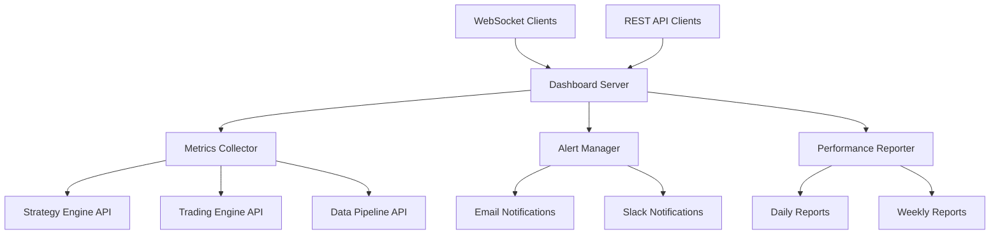

# 🎯 Monitoring Dashboard - Complete Implementation Guide

## 📖 Table of Contents

1. [Quick Start Guide](#quick-start-guide)
2. [Architecture Overview](#architecture-overview)
3. [Installation & Setup](#installation--setup)
4. [Configuration Guide](#configuration-guide)
5. [Usage Examples](#usage-examples)
6. [API Reference](#api-reference)
7. [Deployment Guide](#deployment-guide)
8. [Troubleshooting](#troubleshooting)
9. [Best Practices](#best-practices)
10. [Advanced Features](#advanced-features)

## 🚀 Quick Start Guide

### 30-Second Setup

```bash
# Navigate to the project
cd /Users/sivarajumalladi/Documents/GitHub/monitoring-dashboard

# Install dependencies (one-time setup)
pip install fastapi uvicorn websockets pandas pyyaml psutil requests
pip install -e .

# Start the dashboard
python bin/dashboard_server.py

# Open your browser to: http://localhost:8000
```

### Verify Installation

```bash
# Test the API
curl http://localhost:8000/api/health

# Expected response:
{
  "status": "healthy",
  "timestamp": "2025-07-19T...",
  "version": "1.0.0"
}
```

## 🏗️ Architecture Overview

### System Components



### Data Flow

1. **Metrics Collection**: Collects data from trading services every 30 seconds
2. **Real-time Updates**: Broadcasts updates to connected WebSocket clients
3. **Alert Processing**: Evaluates metrics against configured rules
4. **Report Generation**: Creates scheduled performance reports
5. **Data Storage**: Persists metrics and alerts in SQLite databases

## 💻 Installation & Setup

### Prerequisites

```bash
# Check Python version (3.8+ required)
python --version

# Check pip
pip --version
```

### Step-by-Step Installation

#### 1. Environment Setup

```bash
# Create virtual environment (recommended)
python -m venv monitoring-env
source monitoring-env/bin/activate  # On macOS/Linux
# monitoring-env\Scripts\activate  # On Windows

# Navigate to project directory
cd /Users/sivarajumalladi/Documents/GitHub/monitoring-dashboard
```

#### 2. Install Dependencies

```bash
# Install core dependencies
pip install fastapi==0.104.1
pip install uvicorn[standard]==0.24.0
pip install websockets==12.0
pip install pandas==2.1.3
pip install pyyaml==6.0.1
pip install psutil==5.9.6
pip install requests==2.31.0

# Install from requirements file
pip install -r requirements.txt

# Install package in development mode
pip install -e .
```

#### 3. Directory Structure Setup

```bash
# Create necessary directories
mkdir -p data logs reports

# Verify directory structure
ls -la
```

#### 4. Configuration

```bash
# Copy example configuration
cp config/dashboard_config.yaml config/dashboard_config.yaml.backup

# Verify configuration files exist
ls config/
```

### Verification

```bash
# Test import
python -c "from monitoring_dashboard import MetricsCollector; print('Import successful')"

# Test server startup
python bin/dashboard_server.py --help
```

## ⚙️ Configuration Guide

### Dashboard Configuration (`config/dashboard_config.yaml`)

#### Basic Configuration

```yaml
# Server Settings
server:
  host: "0.0.0.0"        # Bind to all interfaces
  port: 8000              # HTTP port
  debug: false            # Production mode
  cors_enabled: true      # Enable CORS for web access

# Metrics Collection
metrics:
  update_interval: 30     # Collect metrics every 30 seconds
  history_days: 30        # Retain 30 days of history
  collection_timeout: 10  # Timeout for external API calls
```

#### Advanced Configuration

```yaml
# Data Sources
metrics:
  sources:
    strategy_engine:
      url: "http://localhost:8001/api/metrics"
      enabled: true
      timeout: 5
    
    trading_engine:
      url: "http://localhost:8002/api/metrics"
      enabled: true
      timeout: 5
    
    data_pipeline:
      url: "http://localhost:8003/api/metrics"
      enabled: true
      timeout: 5

# Security Settings
security:
  api_key_enabled: false
  rate_limiting:
    enabled: true
    requests_per_minute: 100
```

### Alert Configuration (`config/alert_rules.yaml`)

#### Basic Alert Rules

```yaml
rules:
  - name: "High Daily Loss"
    condition: "daily_pnl < -10000"
    severity: "high"
    enabled: true
    description: "Daily P&L exceeds ₹10,000 loss"
    cooldown: 3600  # 1 hour
    
  - name: "System Offline"
    condition: "system_status != 'online'"
    severity: "critical"
    enabled: true
    cooldown: 300   # 5 minutes
```

#### Notification Setup

```yaml
notifications:
  email:
    enabled: true
    smtp_server: "smtp.gmail.com"
    smtp_port: 587
    username: "your-email@gmail.com"
    password: "your-app-password"
    recipients: ["trader@example.com"]
  
  slack:
    enabled: true
    webhook_url: "https://hooks.slack.com/services/YOUR/SLACK/WEBHOOK"
    channel: "#trading-alerts"
```

## 📖 Usage Examples

### Starting the Dashboard

#### Development Mode

```bash
# Start with debug logging
python bin/dashboard_server.py --debug

# Start on custom port
python bin/dashboard_server.py --port 8080

# Start with custom host
python bin/dashboard_server.py --host 127.0.0.1
```

#### Production Mode

```bash
# Start with production settings
python bin/dashboard_server.py --host 0.0.0.0 --port 8000

# Background process with nohup
nohup python bin/dashboard_server.py > logs/dashboard.log 2>&1 &

# Using systemd (recommended for production)
sudo systemctl start monitoring-dashboard
```

### Alert Management

#### Running Alert Service

```bash
# Start alert manager
python bin/alert_manager.py

# Start with debug logging
python bin/alert_manager.py --debug

# Create test alert
python bin/alert_manager.py --test
```

#### Custom Alert Creation

```python
from monitoring_dashboard.alerts.alert_manager import AlertManager

async def create_custom_alert():
    alert_manager = AlertManager()
    
    await alert_manager.create_alert(
        alert_type="Custom Performance Alert",
        severity="medium",
        message="Strategy performance dropped below threshold",
        source="custom_monitor",
        metadata={"strategy": "momentum", "threshold": -5000}
    )
```

### Report Generation

#### Daily Reports

```bash
# Generate today's report
python bin/report_generator.py --type daily

# Save to file
python bin/report_generator.py --type daily --output reports/daily_$(date +%Y-%m-%d).json

# Generate with debug info
python bin/report_generator.py --type daily --debug
```

#### Weekly Reports

```bash
# Generate weekly report
python bin/report_generator.py --type weekly

# Save to specific location
python bin/report_generator.py --type weekly --output /path/to/weekly_report.json
```

#### Custom Reports

```bash
# Custom date range
python bin/report_generator.py --type custom \
  --start-date 2025-01-01 \
  --end-date 2025-01-07 \
  --output reports/custom_report.json
```

### Programmatic Usage

#### Metrics Collection

```python
from monitoring_dashboard.monitoring.metrics_collector import MetricsCollector
import asyncio

async def collect_metrics():
    collector = MetricsCollector()
    metrics = await collector.get_current_metrics()
    print(f"Current P&L: ₹{metrics.get('daily_pnl', 0):,.2f}")
    print(f"Active Strategies: {metrics.get('active_strategies', 0)}")
    return metrics

# Run the collector
metrics = asyncio.run(collect_metrics())
```

#### Dashboard Data Access

```python
from monitoring_dashboard.dashboards.strategy_dashboard import StrategyDashboard
import asyncio

async def get_dashboard_data():
    dashboard = StrategyDashboard()
    
    # Get performance data
    performance = await dashboard.get_performance_data()
    
    # Get strategy allocation
    allocation = await dashboard.get_allocation_data()
    
    # Get strategy summary
    strategies = await dashboard.get_strategy_summary()
    
    return {
        "performance": performance,
        "allocation": allocation,
        "strategies": strategies
    }

# Get dashboard data
data = asyncio.run(get_dashboard_data())
```

## 🔌 API Reference

### REST API Endpoints

#### Health Check

```http
GET /api/health
```

**Response:**
```json
{
  "status": "healthy",
  "timestamp": "2025-07-19T10:30:00Z",
  "version": "1.0.0"
}
```

#### Dashboard Data

```http
GET /api/dashboard-data
```

**Response:**
```json
{
  "metrics": {
    "system_status": "online",
    "active_strategies": 5,
    "daily_pnl": 2450.75,
    "active_alerts": 2
  },
  "performance": {
    "timestamps": ["2025-07-18", "2025-07-19"],
    "values": [1000000, 1002450.75]
  },
  "allocation": {
    "labels": ["Momentum", "Mean Reversion", "Breakout"],
    "values": [40, 35, 25]
  },
  "strategies": [
    {
      "name": "Momentum Strategy",
      "status": "active",
      "pnl": "+₹2,450",
      "signals": "12"
    }
  ],
  "alerts": [
    {
      "type": "Performance Alert",
      "severity": "medium",
      "message": "Strategy performance below threshold",
      "timestamp": "2025-07-19T10:30:00Z"
    }
  ]
}
```

### WebSocket API

#### Connection

```javascript
const ws = new WebSocket('ws://localhost:8000/ws');

ws.onmessage = function(event) {
    const data = JSON.parse(event.data);
    console.log('Dashboard update:', data);
};
```

#### Message Format

```json
{
  "type": "dashboard_update",
  "timestamp": "2025-07-19T10:30:00Z",
  "data": {
    "metrics": { /* metrics object */ },
    "performance": { /* performance data */ },
    "alerts": [ /* alerts array */ ]
  }
}
```

### Python API

#### MetricsCollector

```python
from monitoring_dashboard.monitoring.metrics_collector import MetricsCollector

collector = MetricsCollector()

# Get current metrics
metrics = await collector.get_current_metrics()

# Get historical metrics
history = await collector.get_historical_metrics(days=7)

# Get alert count
alert_count = await collector.get_alert_count()
```

#### AlertManager

```python
from monitoring_dashboard.alerts.alert_manager import AlertManager

alert_manager = AlertManager()

# Create alert
await alert_manager.create_alert(
    alert_type="Custom Alert",
    severity="high",
    message="Custom alert message",
    source="api"
)

# Get recent alerts
alerts = await alert_manager.get_recent_alerts(limit=10)

# Check system alerts
new_alerts = await alert_manager.check_system_alerts(metrics)
```

## 🚀 Deployment Guide

### Development Deployment

#### Local Development

```bash
# Start development server
python bin/dashboard_server.py --debug

# Start alert manager in separate terminal
python bin/alert_manager.py --debug

# Generate test reports
python bin/report_generator.py --type daily
```

#### Testing Configuration

```yaml
# config/dashboard_config.yaml (development)
server:
  debug: true
  host: "localhost"
  port: 8000

metrics:
  update_interval: 10  # Faster updates for development

database:
  sqlite_path: "data/dev_dashboard.db"

logging:
  level: "DEBUG"
```

### Production Deployment

#### Using Docker

**Dockerfile:**
```dockerfile
FROM python:3.9-slim

WORKDIR /app

COPY requirements.txt .
RUN pip install -r requirements.txt

COPY . .
RUN pip install -e .

EXPOSE 8000

CMD ["python", "bin/dashboard_server.py", "--host", "0.0.0.0", "--port", "8000"]
```

**Build and Run:**
```bash
# Build image
docker build -t monitoring-dashboard .

# Run container
docker run -d \
  --name monitoring-dashboard \
  -p 8000:8000 \
  -v $(pwd)/data:/app/data \
  -v $(pwd)/config:/app/config \
  monitoring-dashboard
```

#### Using Docker Compose

**docker-compose.yml:**
```yaml
version: '3.8'

services:
  dashboard:
    build: .
    ports:
      - "8000:8000"
    volumes:
      - ./data:/app/data
      - ./config:/app/config
      - ./logs:/app/logs
    environment:
      - MONITORING_CONFIG=/app/config/dashboard_config.yaml
    restart: unless-stopped
    
  alert-manager:
    build: .
    command: python bin/alert_manager.py
    volumes:
      - ./data:/app/data
      - ./config:/app/config
      - ./logs:/app/logs
    depends_on:
      - dashboard
    restart: unless-stopped
```

**Start Services:**
```bash
docker-compose up -d
```

#### Using Systemd (Linux)

**Service File:** `/etc/systemd/system/monitoring-dashboard.service`
```ini
[Unit]
Description=Monitoring Dashboard
After=network.target

[Service]
Type=simple
User=monitoring
Group=monitoring
WorkingDirectory=/opt/monitoring-dashboard
Environment=PYTHONPATH=/opt/monitoring-dashboard
ExecStart=/opt/monitoring-dashboard/venv/bin/python bin/dashboard_server.py
Restart=always
RestartSec=10

[Install]
WantedBy=multi-user.target
```

**Install and Start:**
```bash
# Install service
sudo systemctl daemon-reload
sudo systemctl enable monitoring-dashboard
sudo systemctl start monitoring-dashboard

# Check status
sudo systemctl status monitoring-dashboard
```

### Environment Variables

```bash
# Configuration
export MONITORING_CONFIG=/path/to/config.yaml
export MONITORING_DEBUG=false
export MONITORING_LOG_LEVEL=INFO

# Database
export MONITORING_DATA_DIR=/path/to/data
export MONITORING_DB_PATH=/path/to/dashboard.db

# Server
export MONITORING_HOST=0.0.0.0
export MONITORING_PORT=8000

# Notifications
export MONITORING_SMTP_SERVER=smtp.gmail.com
export MONITORING_SMTP_USERNAME=your-email@gmail.com
export MONITORING_SLACK_WEBHOOK=https://hooks.slack.com/services/...
```

## 🔍 Troubleshooting

### Common Issues

#### Dashboard Not Loading

**Problem:** Browser shows "Connection Refused"

**Solution:**
```bash
# Check if server is running
ps aux | grep dashboard_server

# Check port availability
netstat -tulpn | grep 8000

# Check logs
tail -f logs/dashboard.log

# Restart server
python bin/dashboard_server.py --debug
```

#### Metrics Not Updating

**Problem:** Dashboard shows old data

**Solution:**
```bash
# Test metrics collection
python -c "
from monitoring_dashboard.monitoring.metrics_collector import MetricsCollector
import asyncio
collector = MetricsCollector()
print(asyncio.run(collector.get_current_metrics()))
"

# Check external service connectivity
curl http://localhost:8001/api/metrics
curl http://localhost:8002/api/metrics

# Restart metrics collection
python bin/alert_manager.py --test
```

#### Alerts Not Firing

**Problem:** No alerts despite threshold breaches

**Solution:**
```bash
# Test alert system
python bin/alert_manager.py --test

# Check alert configuration
python -c "
from monitoring_dashboard.utils.config_loader import ConfigLoader
import yaml
config = ConfigLoader().load_alert_config()
print(yaml.dump(config, default_flow_style=False))
"

# Check alert database
sqlite3 data/alerts.db "SELECT * FROM alerts ORDER BY timestamp DESC LIMIT 5;"
```

#### High Memory Usage

**Problem:** Dashboard consuming too much memory

**Solution:**
```bash
# Check memory usage
ps aux | grep python | grep dashboard

# Monitor memory usage
top -p $(pgrep -f dashboard_server)

# Optimize configuration
# Reduce history_days and max_data_points in config
```

### Database Issues

#### Corrupted Database

```bash
# Check database integrity
sqlite3 data/metrics.db "PRAGMA integrity_check;"

# Backup and recreate
cp data/metrics.db data/metrics.db.backup
rm data/metrics.db
python bin/dashboard_server.py  # Will recreate database
```

#### Performance Issues

```bash
# Analyze slow queries
sqlite3 data/metrics.db "PRAGMA query_planner;"

# Rebuild indexes
sqlite3 data/metrics.db "REINDEX;"

# Vacuum database
sqlite3 data/metrics.db "VACUUM;"
```

### Network Issues

#### Port Conflicts

```bash
# Find process using port 8000
lsof -i :8000

# Kill conflicting process
kill $(lsof -t -i:8000)

# Use different port
python bin/dashboard_server.py --port 8001
```

#### CORS Issues

```bash
# Check CORS configuration
grep -A 5 "cors" config/dashboard_config.yaml

# Test CORS headers
curl -H "Origin: http://localhost:3000" \
     -H "Access-Control-Request-Method: GET" \
     -H "Access-Control-Request-Headers: X-Requested-With" \
     -X OPTIONS \
     http://localhost:8000/api/health
```

## 📚 Best Practices

### Configuration Management

#### Environment-Specific Configs

```bash
# Development
config/
├── dashboard_config.yaml
├── dashboard_config.dev.yaml
├── dashboard_config.staging.yaml
└── dashboard_config.prod.yaml
```

#### Secret Management

```bash
# Use environment variables for secrets
export MONITORING_SMTP_PASSWORD="your-secret-password"
export MONITORING_SLACK_WEBHOOK="your-webhook-url"

# Reference in config
smtp:
  password: ${MONITORING_SMTP_PASSWORD}
```

### Performance Optimization

#### Database Optimization

```sql
-- Add indexes for better performance
CREATE INDEX idx_metrics_timestamp ON metrics(timestamp);
CREATE INDEX idx_alerts_severity ON alerts(severity);
CREATE INDEX idx_alerts_resolved ON alerts(resolved);
```

#### Memory Management

```python
# Limit data retention
metrics:
  history_days: 30  # Don't keep too much history
  max_data_points: 1000  # Limit chart data points

# Use efficient data structures
import pandas as pd
df = pd.DataFrame(data).groupby('metric_name').tail(100)  # Limit recent data
```

### Security Best Practices

#### API Security

```yaml
# Enable API key authentication
security:
  api_key_enabled: true
  rate_limiting:
    enabled: true
    requests_per_minute: 100
```

#### Data Protection

```bash
# Encrypt sensitive configuration
gpg --symmetric config/dashboard_config.yaml

# Use secure file permissions
chmod 600 config/dashboard_config.yaml
chmod 700 data/
```

### Monitoring Best Practices

#### Health Checks

```python
# Implement comprehensive health checks
async def health_check():
    checks = {
        "database": await check_database_connection(),
        "external_apis": await check_external_services(),
        "disk_space": check_disk_space(),
        "memory_usage": check_memory_usage()
    }
    return all(checks.values())
```

#### Logging Strategy

```python
# Structured logging
import structlog

logger = structlog.get_logger()
logger.info("Dashboard started", port=8000, debug=False)
logger.error("Database connection failed", error=str(e), retry_count=3)
```

## 🔧 Advanced Features

### Custom Alert Rules

#### Complex Conditions

```yaml
# Advanced alert conditions
rules:
  - name: "Strategy Correlation Alert"
    condition: "strategy_correlation > 0.8 AND active_strategies > 3"
    severity: "medium"
    
  - name: "Performance Degradation"
    condition: "sharpe_ratio < 1.0 AND max_drawdown < -10"
    severity: "high"
```

#### Custom Alert Functions

```python
# Custom alert evaluation
def evaluate_custom_condition(metrics):
    """Custom logic for complex alert conditions"""
    if metrics.get('win_rate', 0) < 40 and metrics.get('daily_pnl', 0) < -5000:
        return True  # Trigger alert
    return False
```

### Real-time Data Sources

#### WebSocket Data Feeds

```python
# Real-time market data integration
async def connect_market_data():
    uri = "wss://api.marketdata.com/v1/stocks/quotes"
    async with websockets.connect(uri) as websocket:
        await websocket.send(json.dumps({
            "action": "subscribe",
            "symbols": ["AAPL", "GOOGL", "MSFT"]
        }))
        async for message in websocket:
            data = json.loads(message)
            await process_market_data(data)
```

#### Message Queue Integration

```python
# Redis/RabbitMQ integration for real-time updates
import redis
import json

redis_client = redis.Redis(host='localhost', port=6379, db=0)

async def publish_update(channel, data):
    redis_client.publish(channel, json.dumps(data))

async def subscribe_updates(channel):
    pubsub = redis_client.pubsub()
    pubsub.subscribe(channel)
    
    for message in pubsub.listen():
        if message['type'] == 'message':
            data = json.loads(message['data'])
            await process_update(data)
```

### Machine Learning Integration

#### Anomaly Detection

```python
# Anomaly detection using isolation forest
from sklearn.ensemble import IsolationForest
import numpy as np

class AnomalyDetector:
    def __init__(self):
        self.model = IsolationForest(contamination=0.1)
        self.trained = False
    
    def train(self, historical_data):
        features = np.array(historical_data)
        self.model.fit(features)
        self.trained = True
    
    def detect_anomaly(self, current_metrics):
        if not self.trained:
            return False
        
        features = np.array([current_metrics]).reshape(1, -1)
        prediction = self.model.predict(features)
        return prediction[0] == -1  # -1 indicates anomaly
```

#### Predictive Analytics

```python
# Performance prediction using time series
from statsmodels.tsa.arima.model import ARIMA

class PerformancePredictor:
    def __init__(self):
        self.model = None
    
    def train(self, historical_pnl):
        self.model = ARIMA(historical_pnl, order=(1, 1, 1))
        self.fitted_model = self.model.fit()
    
    def predict_next_day(self):
        if self.model is None:
            return None
        
        forecast = self.fitted_model.forecast(steps=1)
        return forecast[0]
```

### Dashboard Customization

#### Custom Widgets

```javascript
// Custom chart widget
class CustomPerformanceChart {
    constructor(containerId, options) {
        this.container = document.getElementById(containerId);
        this.options = options;
        this.chart = null;
        this.init();
    }
    
    init() {
        const ctx = this.container.getContext('2d');
        this.chart = new Chart(ctx, {
            type: 'line',
            data: { labels: [], datasets: [] },
            options: this.options
        });
    }
    
    updateData(data) {
        this.chart.data.labels = data.timestamps;
        this.chart.data.datasets[0].data = data.values;
        this.chart.update();
    }
}
```

#### Theme Customization

```css
/* Custom dashboard theme */
:root {
    --primary-color: #007bff;
    --success-color: #28a745;
    --warning-color: #ffc107;
    --danger-color: #dc3545;
    --dark-color: #343a40;
    --light-color: #f8f9fa;
}

.dashboard-theme-dark {
    --bg-color: #1a1a1a;
    --text-color: #ffffff;
    --card-bg: #2d2d2d;
    --border-color: #444444;
}

.dashboard-theme-light {
    --bg-color: #ffffff;
    --text-color: #333333;
    --card-bg: #f8f9fa;
    --border-color: #dee2e6;
}
```

---

**Implementation Status**: ✅ **Complete Core System**
**Next Steps**: 🚀 **Testing & Production Deployment**
**Support**: 📧 **Contact development team for assistance**
